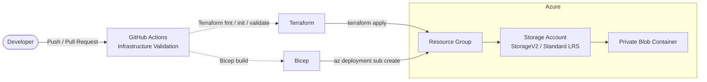

# Azure Infrastructure Automation

**Infrastructure-as-Code and DevOps project demonstrating automated Azure infrastructure provisioning with Terraform and Bicep, supported by GitHub Actions for continuous validation.**


## 📋 Overview

This project demonstrates how cloud infrastructure can be **defined and managed as code** instead of being manually created through the Azure Portal.

The same Azure environment is defined using both **Terraform** and **Bicep**:

- Azure Resource Group
- Azure Storage Account
- Private Blob Storage container

The project also includes a **GitHub Actions CI pipeline** that automatically validates both Terraform and Bicep whenever relevant infrastructure code changes.

The goal is to demonstrate practical experience with:

- Infrastructure as Code (IaC)
- Azure resource provisioning
- Terraform
- Azure Bicep
- GitHub Actions
- Infrastructure validation
- Secure-by-default cloud configuration

## 🏗️ Architecture



### Infrastructure

Both implementations define the same core Azure infrastructure:

| Resource | Configuration |
|---|---|
| **Resource Group** | Canada Central by default |
| **Storage Account** | StorageV2, Standard LRS |
| **Blob Container** | Private access |

The Storage Account is configured with:

- TLS 1.2 minimum
- HTTPS-only traffic
- Public Blob access disabled
- Private container access

## 🆚 Terraform vs. Bicep

The project intentionally implements the same infrastructure using two IaC tools to compare their approaches.

| Concern | Terraform | Bicep |
|---|---|---|
| Cloud platform | Multi-cloud capable through providers | Azure-native |
| Resource group | `azurerm_resource_group` | Subscription-scoped resource |
| Structure | `main.tf`, `variables.tf`, `outputs.tf` | `main.bicep` + `storage.bicep` module |
| Inputs | Terraform variables / `.tfvars` | Bicep parameters / JSON |
| State | Terraform state file | No Terraform-style state; Azure Resource Manager manages deployment operations |
| Provider/API versioning | AzureRM provider version | Azure resource API versions |
| Validation | `terraform fmt` / `terraform validate` | `az bicep build` |
| Dependency handling | Resource references | Resource references and module scope |

## 🔄 Continuous Integration

GitHub Actions automatically validates infrastructure changes.

### Terraform

```text
terraform fmt -check
        ↓
terraform init -backend=false
        ↓
terraform validate
```

### Bicep

```text
az bicep install
        ↓
az bicep build
```

The workflow:

- Runs when Terraform or Bicep files change
- Runs on pushes to `main` and pull requests
- Uses separate Terraform and Bicep validation jobs
- Does not deploy Azure resources
- Does not require Azure subscription credentials

This allows infrastructure configuration errors to be detected before deployment.

## ✨ Key Features

- **Dual-tool IaC:** equivalent Azure infrastructure defined using Terraform and Bicep
- **Parameterized configuration:** resource names, location, container name, and environment are configurable
- **Terraform input validation:** Storage Account names are validated before deployment
- **Secure-by-default storage:** HTTPS-only traffic, TLS 1.2, and private Blob access
- **Modular Bicep:** storage resources are separated into a reusable Bicep module
- **Terraform outputs:** exposes resource IDs, names, and Blob endpoint information
- **Automated CI validation:** infrastructure code is checked automatically through GitHub Actions
- **Repository hygiene:** Terraform state, `.tfvars`, secrets, and local tooling files are excluded from version control

## 🛠️ Tech Stack

| Area | Technology |
|---|---|
| Infrastructure as Code | Terraform, Azure Bicep |
| Cloud | Microsoft Azure |
| Azure Services | Resource Groups, Storage Accounts, Blob Storage |
| CI | GitHub Actions |
| CLI / Tooling | Azure CLI, Terraform CLI |
| Version Control | Git / GitHub |

## 📁 Repository Structure

```text
azure-infrastructure-automation/
├── .github/
│   └── workflows/
│       └── infrastructure-validation.yml
│
├── terraform/
│   ├── main.tf
│   ├── variables.tf
│   ├── outputs.tf
│   ├── terraform.tfvars.example
│   └── .terraform.lock.hcl
│
├── bicep/
│   ├── main.bicep
│   ├── storage.bicep
│   └── parameters.json
│
├── .gitignore
└── README.md
```

## ☁️ Azure Infrastructure

The project is intentionally small so the focus remains on Infrastructure as Code and automation rather than application development.

### Resource Group

Default:

```text
devops-iac-rg
```

### Storage Account

Configured with:

```text
StorageV2
Standard LRS
TLS 1.2 minimum
HTTPS-only traffic
Public Blob access disabled
```

### Blob Container

Default:

```text
data
```

The container is configured for private access.

## 🚀 Deployment

### Terraform

After configuring Azure CLI authentication and creating a unique Storage Account name:

```bash
cd terraform

terraform init
terraform fmt
terraform validate
terraform plan
terraform apply
```

Terraform can remove the infrastructure when testing is complete:

```bash
terraform destroy
```

### Bicep

The Bicep entry point uses subscription scope because it creates the Resource Group itself.

Preview the deployment:

```bash
cd bicep

az deployment sub what-if \
  --location canadacentral \
  --template-file main.bicep \
  --parameters @parameters.json
```

Deploy:

```bash
az deployment sub create \
  --location canadacentral \
  --template-file main.bicep \
  --parameters @parameters.json
```

The Resource Group can be removed after testing:

```bash
az group delete --name devops-iac-rg
```

> **Important:** Terraform and Bicep use the same default resource names. They should be treated as alternative deployment methods rather than deployed simultaneously against the same resources.

## 🔐 Security & Repository Practices

The project avoids storing credentials or secrets in source control.

`.gitignore` excludes:

- Terraform state files
- `.tfvars` files
- Environment files
- Local Terraform provider files
- Local IDE configuration
- Private keys

The repository includes `terraform.tfvars.example` as a template without environment-specific secrets.

## 💰 Cost Considerations

The project intentionally avoids compute-heavy or continuously running Azure services such as:

- Virtual Machines
- Azure Kubernetes Service
- Managed databases
- Private Endpoints

The core deployment consists of a Resource Group and a Standard LRS Storage Account with a private Blob container.

Azure resources should only be provisioned when needed for testing and destroyed afterward.

## ⚠️ Current Limitations

- **CI validates but does not deploy:** GitHub Actions currently performs local Terraform and Bicep validation without Azure credentials.
- **Local Terraform state:** Terraform state is stored locally rather than in a shared remote backend.
- **Single environment:** the project currently targets one environment rather than separate dev/staging/production environments.
- **No automated security scanning:** tools such as Checkov or PSRule could be added in the future.
- **Small infrastructure footprint:** the project focuses on IaC rather than networking, compute, identity, or application infrastructure.

## 🔮 Future Improvements

Potential extensions include:

- Remote Terraform state using Azure Storage
- GitHub Actions authentication to Azure using OpenID Connect
- Automated Terraform plans on pull requests
- Approval-gated deployments
- Separate development and production environments
- IaC security and policy scanning
- Azure networking, managed identities, and Key Vault